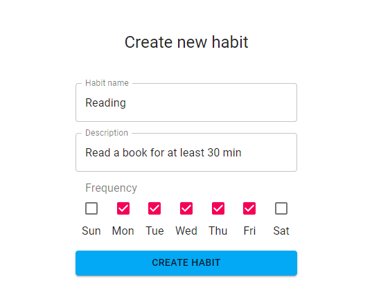
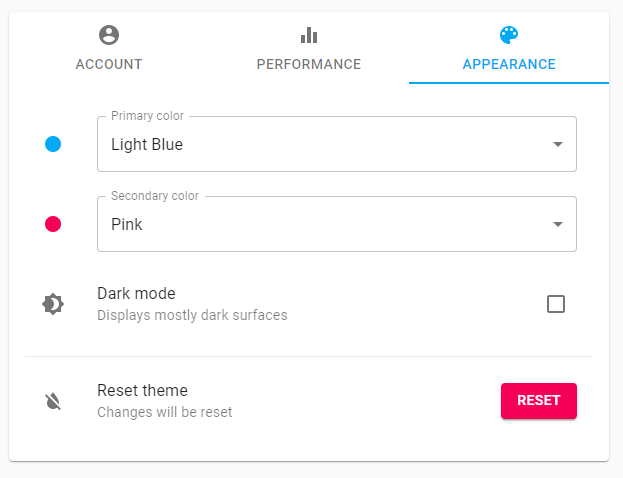

# Habit Tracker Web App

## Table of Contents

1. [Description](#description)
2. [Tech Stack](#tech-stack)
3. [Features](#features)
4. [How to Run the Project](#how-to-run-the-project)
   - [Prerequisites](#prerequisites)
   - [Steps to Run Locally](#steps-to-run-locally)
5. [Screenshots](#screenshots)
6. [Team Members](#team-members)
7. [Challenges & Learning](#challenges--learning)
8. [Future Improvements](#future-improvements-optional)

## Description
The **Habit Tracker** app is a web application designed to help users track their habits, visualize their performance, and maintain consistency. Users can log in with their email or third-party authentication (Google, Facebook, GitHub), create and manage habits, and view their progress through a visualized bar chart.

This project was developed as part of our final project for 'Advanced Web Application' class and is aimed at improving habit-building by providing users with a simple, yet powerful tool for habit tracking and performance evaluation.

## Tech Stack
- **Frontend**: 
  - **React**: For building the user interface and managing components.
  - **React Router**: For handling navigation and routing.
  - **Material UI**: For a modern and responsive design using pre-built components.
  - **React Query**: For data fetching and state management.
  - **React Hook Form**: For handling form inputs and validation.
  
- **Backend**:
  - **Firebase**: 
    - **Authentication**: To manage user sign-up and login (email/password, Google, Facebook, GitHub).
    - **Realtime Database**: To store user data, habits, and their completion status.

## Features
- **Authentication**: 
  - Users can create an account using email and password or log in with Google, Facebook, or GitHub.
  - Login as a guest to try the app without creating an account.

- **Habit Management**: 
  - Add, edit, and delete habits.
  - Mark habits as `completed`, `failed`, or `skipped`.
  - Visualize weekly performance in a bar chart.
  
- **Customizable UI**: 
  - Users can customize the app’s primary and secondary colors.
  - Toggle between light and dark modes.
  
- **Multi-language Support**: 
  - Available in **English** and **Spanish**.
  
- **Progress Tracking**: 
  - View summaries of habit performance for the last week, current week, current day, and overall.

## How to Run the Project

### Prerequisites
Before running the app locally, ensure that you have the following installed:
- **Node.js** (with npm or yarn)
- **Firebase account** to set up Firebase services

### Steps to Run Locally
1. Clone the repository:
   ```bash
   git clone https://github.com/your-username/habit-tracker-app.git
2. Navigate to the project folder:
    ```bash
    cd habit-tracker-app
3. Install dependencies using Yarn:
    ```bash
    yarn
4. Set up Firebase:
    - Login to Firebase Console.
    - Create a new project and configure the Authentication method.
    - Enable Email/Password, Google, Facebook, and GitHub sign-in providers.
    - Set up the Realtime Database and adjust security rules.
    - Copy the Firebase configuration (firebaseConfig) and add it to a new .env.local file.
5. Start the development server:
    ```bash
    yarn start
6. Open the app in your browser at http://localhost:3000

## Screenshots

* Landing Page


* Sign up using **Facebook**, **GitHub**, **Google** or create a new account using your email address.


* Create new habit



* Manage your habits - preview, edit or delete your habits


* Keep track of your habits in the Dashboard


* Change your settings



* Customize the app the way you want


## Team Members
- **Nurtilek Tobokelov**
- **Baitur Temiraliev**

## Challenges & Learning

### Challenges:
- **Authentication**: We encountered some issues setting up Firebase authentication, especially with third-party providers like Google, Facebook, and GitHub. We had to carefully configure Firebase and adjust the authentication flow to ensure smooth login experiences.
  
- **Database Structure**: Deciding how to structure the habit data for tracking performance was a key challenge. We decided to store the habits and their completion states separately, making it easy to fetch and visualize data.

- **Localization**: Implementing multi-language support was a challenge because it involved managing translation files and integrating them into the app. We had to ensure smooth switching between languages and provide users with a simple interface for language selection.

### What We Learned:
- **React Development**: We improved our skills in building React applications with dynamic state management and routing.
  
- **Firebase Integration**: We learned how to set up and integrate Firebase for both authentication and data storage.

- **Responsive Design**: Using Material UI, we ensured the app’s responsiveness, making it adaptable to different screen sizes, including mobile devices.

- **Localization**: Implementing multi-language support was a valuable learning experience in making applications accessible to a broader audience.

## Future Improvements (Optional)
If we had more time, we would consider adding the following features:

- **Mobile App**: Create a mobile version of the Habit Tracker app using React Native for iOS and Android.

- **Push Notifications**: Implement reminders to help users stay on track with their habits.

- **Advanced Habit Statistics**: Include more advanced analytics like streaks, success rates, and comparison of habits.
